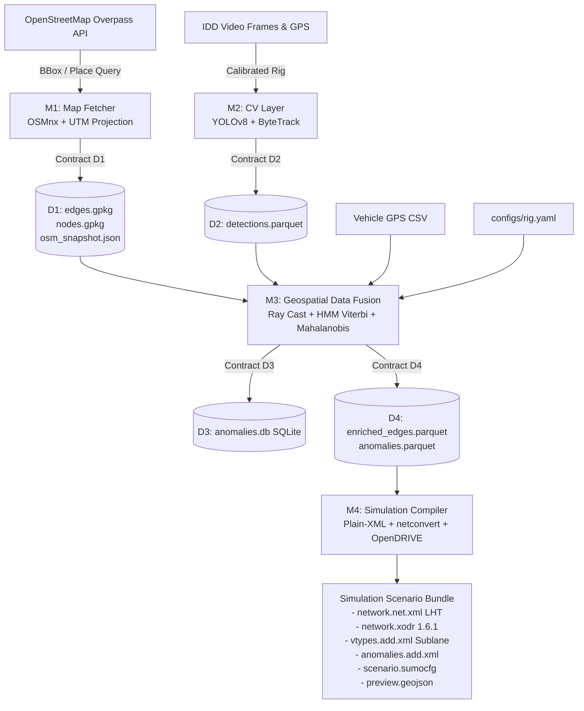

# IRN Engine (`irn`)
### Automated Road Network Modeling Engine for Lane-Free Indian Traffic Simulations

[](https://pypi.org/project/irn-engine/)
[](https://www.python.org/)
[](https://opensource.org/licenses/MIT)
[-green.svg)]()
[]()
[]()

> **B.Tech CSE Major Project (2026–27)**  
> **Department of Computer Science & Engineering**  
> **Shri Vaishnav Institute of Information Technology (SVIIT), SVVV, Indore**

---

## 1. Overview & Problem Statement

Standard microscopic traffic simulators (Eclipse SUMO, CARLA) and autonomous driving models inherently assume **lane-disciplined, homogeneous traffic** operating on uniformly marked roads.

Indian urban traffic fundamentally breaks these assumptions:
- **Heterogeneous Traffic Mix:** Roads are shared by two-wheelers, auto-rickshaws, cars, commercial buses, trucks, cycle rickshaws, pedestrians, and stray animals.
- **Lane-Free Lateral Dynamics:** Vehicles navigate opportunistically without following painted lane boundaries, packing tightly into lateral gaps.
- **Unmapped Physical Anomalies:** Potholes, unstandardized speed breakers, barricades, and parked vehicle obstructions actively constrain vehicle trajectories and speed profiles.

**IRN Engine** is a high-performance Python data pipeline that bridges this gap. It ingests static road networks from **OpenStreetMap (OSM)**, fuses localized obstacle detections from the **IIIT-Hyderabad Indian Driving Dataset (IDD Multimodal)** using rigorous mathematical geospatial fusion, and compiles simulation-ready networks for **Eclipse SUMO (Sublane Model)** and **ASAM OpenDRIVE (`.xodr`)**.

---

## 2. Pipeline Architecture

The engine is structured around four decoupled modules communicating strictly via validated **Data Contracts**:



### Module Breakdown & Team Ownership

| Module | Lead | Responsibilities & Scope | Tech Stack |
| :--- | :--- | :--- | :--- |
| **M1: Map Fetcher** | **Yashika Goswami** | OSM acquisition via BBox/place query, rate-limit backoff, attribute normalization (lanes, speed, width), UTM projection, zero-length pruning, Contract D1 export. | `osmnx >= 2.0`, `geopandas`, `shapely`, `pyproj` |
| **M2: CV Layer** | **Vipul Yadav** | IDD Multimodal dataset ingestion, YOLOv8 inference for Indian road obstacles/agents, ByteTrack tracking, bottom-center ground contact projection, Contract D2 Parquet export. | `ultralytics`, `pyarrow`, `pydantic`, `opencv-python` |
| **M3: Geospatial Fusion** | **Yash Pouranik** *(Core)* | Ground-plane ray intersection ($z = -h$), temporal GPS sync, cKDTree candidate filtering, HMM Viterbi map matching, relative linear referencing $(s, t)$, 2-level Mahalanobis de-duplication. | `numpy`, `scipy`, `shapely 2.0`, `pyproj`, `sqlite3` |
| **M4: Simulation Compiler** | **Vivek Tekwani** | SUMO Plain-XML generation (`.nod.xml`, `.edg.xml`), `netconvert` compilation with `--lefthand=true`, Indian vehicle types with arbitrary lateral alignment, ASAM OpenDRIVE 1.6.1 `.xodr` generation. | `lxml`, `sumo-tools`, Eclipse SUMO `>= 1.18` |

---

## 3. Data Contracts

All modules communicate strictly through validated, versioned disk artifacts:

| Contract | Path | Format | Description |
| :--- | :--- | :--- | :--- |
| **D1: Road Graph** | `data/d1_graph/` | GeoPackage (`.gpkg`) + JSON | Cleaned drivable road network (`edges.gpkg`, `nodes.gpkg`, `osm_snapshot.json`) with WGS84 coordinates and local UTM projections. |
| **D2: CV Detections** | `data/d2_detections/` | Apache Parquet (`.parquet`) | Structured obstacle detections (`sequence_id`, `frame_idx`, `frame_ts`, `class_name`, `conf`, `u`, `v`, `track_id`). |
| **D3: Anomaly Ledger** | `data/d3_store/` | SQLite (`anomalies.db`) | Append-only observation log and canonical anomaly lifecycle tracker (`CANDIDATE` $\to$ `CONFIRMED` $\to$ `RESOLVED`). |
| **D4: Enriched Graph** | `data/d4_enriched/` | Apache Parquet | `enriched_edges.parquet` and `anomalies.parquet` with linear referencing offsets $(s, t)$ and lateral positioning. |
| **Output Scenario** | `output_scenario/` | XML + XODR + GeoJSON | SUMO `.net.xml`, `.xodr`, `.sumocfg`, vehicle profiles (`vtypes.add.xml`), obstacle zones (`anomalies.add.xml`), and `preview.geojson`. |

---

## 4. Getting Started & Setup Guide

### 4.1 Prerequisites

- **Python:** 3.10, 3.11, 3.12, or 3.13
- **Operating System:** Windows 10/11, Ubuntu 20.04+, or macOS
- **Optional Tools:**
  - [Eclipse SUMO](https://eclipse.dev/sumo/) ($\ge 1.18$) for running microscopic simulations and SUMO-GUI.
  - [QGIS](https://qgis.org/) for visualizing generated GeoPackages and GeoJSON layers.

---

### 4.2 Clone & Environment Setup

#### Option A: Windows (PowerShell)
```powershell
# 1. Clone repository
git clone https://github.com/yash-pouranik/irn-engine.git
cd irn-engine

# 2. Create virtual environment
python -m venv .venv

# 3. Activate virtual environment
.venv\Scripts\Activate.ps1

# 4. Upgrade pip & build tools
python -m pip install --upgrade pip setuptools wheel
```

> **Note (PowerShell Execution Policy):** If script activation fails with an execution policy error, run:
> ```powershell
> Set-ExecutionPolicy -ExecutionPolicy RemoteSigned -Scope Process
> ```

#### Option B: Linux / macOS (Bash / Zsh)
```bash
# 1. Clone repository
git clone https://github.com/yash-pouranik/irn-engine.git
cd irn-engine

# 2. Create virtual environment
python3 -m venv .venv

# 3. Activate virtual environment
source .venv/bin/activate

# 4. Upgrade pip & build tools
pip install --upgrade pip setuptools wheel
```

---

### 4.3 Install Dependencies

Install the core pipeline in editable mode:

```bash
# Install core pipeline
pip install -e .

# Install optional geospatial, CV, and development tools
pip install -e ".[geo,cv,dev]"
```

Verify your installation:
```bash
irn info
# Or run as a module:
python -m irn.cli info
```

Expected output:
```text
=================================================================
IRN: Road Network Modeling Engine (SVIIT Indore Major Project)
=================================================================
OSMnx Version:    2.1.1
Shapely Version:  2.2.0
PyArrow Version:  25.0.1
Traffic Rule:     Strict Left-Hand Traffic (LHT)
Coordinate Grid:  WGS84 Storage (EPSG:4326) / Local Projected UTM
=================================================================
```

---

## 5. Usage & CLI Workflow

The pipeline is controlled via the `irn` command-line interface.

### 5.1 Generate Synthetic Ground Truth World
To verify mathematical formulas without downloading external maps or videos, generate the synthetic test world:
```bash
irn synth --out data/synthetic --length 150.0
```
This generates:
- `data/synthetic/d1_graph/edges.gpkg` (Synthetic dual-carriageway road)
- `data/synthetic/d1_graph/nodes.gpkg`
- `data/synthetic/d2_data/detections.parquet` (Planted potholes & speed breakers)
- `data/synthetic/d2_data/gps_trajectory.csv` (Simulated vehicle trajectory)

---

### 5.2 Fetch Road Graph from OpenStreetMap (Module 1)

#### Option 1: Live Download via Bounding Box
Fetches drivable network, projects to the optimal local UTM zone, parses Indian road attributes, and exports Contract D1:
```bash
# Example: IIIT-Hyderabad / Gachibowli Corridor (west, south, east, north)
irn fetch --bbox "78.3400,17.4350,78.3650,17.4550" --out data/d1_graph
```

#### Option 2: Live Download via Place Name
```bash
irn fetch --place "Gachibowli, Hyderabad, India" --out data/d1_graph
```

#### Option 3: Offline Mode (No Internet Required)
Generates a calibrated geometric grid for testing without calling the Overpass API:
```bash
irn fetch --offline --out data/d1_graph
```

---

### 5.3 Generate / Ingest Obstacle Detections (Module 2)
Generate schema-validated detections in Apache Parquet format:
```bash
irn detect --seq seq_demo_01 --frames 120 --out data/d2_detections/detections.parquet
```

---

### 5.4 Execute Geospatial Data Fusion (Module 3)
Execute 3D ground-plane ray projection, GPS alignment, HMM Viterbi map matching, relative linear referencing $(s, t)$, and Mahalanobis de-duplication:
```bash
irn fuse --graph data/synthetic/d1_graph/edges.gpkg --detections data/synthetic/d2_data/detections.parquet --gps data/synthetic/d2_data/gps.csv
```

---

### 5.5 Compile Simulation Scenario (Module 4)
Compile enriched road network into Eclipse SUMO (Sublane model) and ASAM OpenDRIVE 1.6.1:
```bash
irn compile --enriched data/d4_enriched/enriched_edges.parquet --anomalies data/d4_enriched/anomalies.parquet --nodes data/synthetic/d1_graph/nodes.gpkg --out output_scenario
```

---

### 5.6 CLI Command Reference

| Command | Arguments / Flags | Description |
| :--- | :--- | :--- |
| `irn info` | None | Displays engine versions, active CRS projection, and convention flags. |
| `irn fetch` | `--bbox <W,S,E,N>`<br>`--place <STR>`<br>`--out <DIR>`<br>`--timeout <SEC>`<br>`--offline` | Ingests drivable OSM network, cleans attributes, normalizes lanes/widths, and saves D1 GeoPackage. |
| `irn detect` | `--seq <NAME>`<br>`--frames <INT>`<br>`--out <FILE>` | Runs detection pipeline / mock generator and writes Contract D2 Parquet. |
| `irn synth` | `--out <DIR>`<br>`--length <METERS>` | Builds a mathematically controlled ground-truth corridor for unit/regression testing. |
| `irn fuse` | `--graph <PATH>`<br>`--detections <PATH>`<br>`--gps <PATH>`<br>`--rig <PATH>` | Executes M3 Ray casting, HMM map matching, and multi-pass anomaly clustering. |
| `irn compile` | `--enriched <PATH>`<br>`--anomalies <PATH>`<br>`--nodes <PATH>`<br>`--out <DIR>` | Compiles Plain-XML $\to$ SUMO `.net.xml` and ASAM OpenDRIVE `.xodr` scenario. |

---

## 6. Configuration Management

Zero magic numbers are permitted in the codebase. All operational parameters are maintained in `configs/`:

### `configs/run_config.yaml`
- **Traffic Conventions:** Left-Hand Traffic (`LHT`).
- **M1 Fetcher:** Target Bounding Box, Overpass timeout, user-agent.
- **M2 CV:** Confidence thresholds ($0.25$ candidate extraction), class taxonomy.
- **M3 Fusion:** GPS max temporal delta ($dt \le 0.2\,\text{s}$), HMM search radius ($35\,\text{m}$), HMM bearing angle gate ($100^\circ$), Mahalanobis Chi-square gate ($\chi^2 = 9.21, p=0.01$).
- **M4 Compiler:** `lanefree_mode: "collapse"`, sublane lateral resolution ($0.6\,\text{m}$), step length ($0.1\,\text{s}$).

### `configs/rig.yaml`
- **Camera Intrinsics:** $f_x, f_y, c_x, c_y$ calibrated for IDD front-facing camera.
- **Extrinsics & Mounting:** Camera height $h = 1.5\,\text{m}$, downward pitch $\theta = -2.5^\circ$, roll/yaw offsets.
- **Processing Gates:** Ground range gate $[4.0\,\text{m}, 30.0\,\text{m}]$, ray projection covariance gates.

---

## 7. Running Tests

Run the complete test suite with `pytest`:

```bash
# Run all tests
pytest

# Run tests with verbose output
pytest -v

# Run tests with execution timing
pytest -v --durations=5
```

### What is Tested:
1. **Rule G-1 (Coordinate Round-Trip Precision):** Asserts sub-millimeter conversion accuracy between WGS84 (`EPSG:4326`) and local UTM projections (Zone 43N/44N).
2. **M1 Attribute Cleaner:** Asserts parsing of non-standard OSM tags (`lanes`, `maxspeed`, `width`) and zero-length edge pruning.
3. **M2 Schema & Ground Contact:** Asserts bottom-center $(u, v)$ calculation and Parquet round-trip serialization.
4. **Synthetic World Fixture:** Validates deterministic graph generation and planted anomaly recovery.

---

## 8. Repository Structure

```text
irn-engine/
├── configs/                       # Configuration parameters (zero magic numbers)
│   ├── rig.yaml                   # Camera intrinsics, mounting height, pitch, range gates
│   └── run_config.yaml            # Pipeline run config, thresholds, and SUMO sublane parameters
├── data/                          # Runtime data artifacts (git-ignored except sample fixtures)
│   ├── d1_graph/                  # Contract D1: edges.gpkg, nodes.gpkg, osm_snapshot.json
│   ├── d2_detections/             # Contract D2: detections.parquet
│   └── synthetic/                 # Synthetic ground truth fixtures
├── irn/                           # Core Engine Python Package
│   ├── cli.py                     # Typer CLI application entry point
│   ├── common/                    # Shared coordinate transformations, I/O, logging
│   │   ├── crs.py                 # Vectorized WGS84 <-> UTM projections
│   │   ├── io.py                  # Atomic file writing & SHA-256 hashing
│   │   └── logger.py              # Structured logging with reason codes
│   ├── m1_fetcher/                # Module 1: OpenStreetMap Ingestion (Yashika)
│   │   ├── cleaner.py             # Tag normalization & graph topology cleaning
│   │   └── osm_fetcher.py         # OSMnx network download with backoff & caching
│   ├── m2_cv_interface/           # Module 2: Computer Vision Interface (Vipul)
│   │   ├── detector.py            # YOLOv8 inference & mock generator
│   │   ├── idd_adapter.py         # IDD Multimodal dataset loader
│   │   └── schema.py              # Pydantic schema & PyArrow Parquet writer
│   ├── m3_fusion/                 # Module 3: Geospatial Data Fusion (Yash)
│   └── m4_compiler/               # Module 4: Simulation Compiler (Vivek)
├── tests/                         # Automated Test Suite (QA Agent)
│   ├── fixtures/
│   │   └── synthetic_world.py     # Ground-truth mathematical test corridor
│   └── test_m1_m2_core.py         # Core CRS, cleaner, schema, and synthetic tests
├── AGENTS.md                      # Multi-Agent Operational Framework & Guardrails
├── PLAN.md                        # Master Phased Engineering Plan
├── pyproject.toml                 # Package configuration & dependencies
└── README.md                      # Project documentation & setup instructions
```

---

## 9. Engineering Constraints & Rules

1. **Rule G-1 (Coordinate Systems):** Stored geometries are always WGS84 (`EPSG:4326`). All distance, ray-casting, and metric computations use the local UTM projection calculated from the area centroid.
2. **Rule G-2 (Traffic Convention):** Strict Left-Hand Traffic (LHT). OpenDRIVE roads declare `rule="LHT"` and SUMO `netconvert` runs with `--lefthand=true`.
3. **Rule G-3 (Vectorization):** Hot paths use `numpy`, `scipy`, `shapely 2.0`, and `pyarrow`. No Python `for` loops over large detection batches.
4. **Rule G-4 (File Decoupling):** Modules do not call each other's internal functions across module boundaries. Communication occurs strictly via Data Contracts (D1, D2, D3, D4).
5. **Rule G-6 (SUMO Construction):** SUMO internal edges are never written by hand. Plain-XML files (`.nod.xml`, `.edg.xml`, `.con.xml`) are compiled via `netconvert`.

---

## 10. Contributors & Major Project Team

**Department of Computer Science & Engineering**  
**Shri Vaishnav Institute of Information Technology (SVIIT), Indore**  
*B.Tech CSE Major Project (2026–27)*

- **Yash Pouranik** — *Team Lead & Algorithmic Owner (Module 3: Geospatial Fusion)*
- **Yashika Goswami** — *Geospatial Data Engineer (Module 1: Map Fetcher)*
- **Vipul Yadav** — *Computer Vision Engineer (Module 2: CV Layer)*
- **Vivek Tekwani** — *Simulation & Standards Engineer (Module 4: Simulation Compiler)*

---

## 11. License & Acknowledgements

- **License:** MIT License. See [LICENSE](LICENSE) for details.
- **Data Attribution:**
  - Road network geometries © [OpenStreetMap contributors](https://www.openstreetmap.org/copyright) (ODbL).
  - Indian Driving Dataset courtesy of [IIIT-Hyderabad CVIT / IDD Multimodal](https://idd.insaan.iiit.ac.in/).
